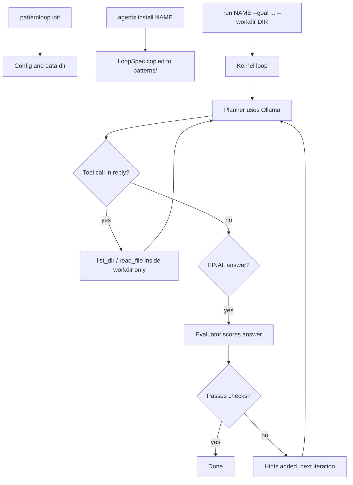

# PatternLoop — local loops that adapt until the goal lands

PatternLoop is a local-first CLI that turns repeatable workflows into versioned **LoopSpecs** (YAML), then runs a tight loop: plan, read files with tools, answer, score the answer, and adapt hints until checks pass or limits hit.

Default brains: **Ollama** on your machine (no cloud API required). Optional connectors can call Claude or n8n only if you turn them on in config.

---

## How PatternLoop works

**1. LoopSpec (the recipe)**  
A LoopSpec is a small YAML file that defines prompts, how success is checked (keywords, minimum length), optional limits, and which tools are allowed. Bundled patterns ship inside this repo; `patternloop agents install` copies one into your data directory so you can run it by name.

**2. Your goal (the task this run)**  
When you run `patternloop run NAME ... --goal "..."`, that text is the specific job for this session (for example “summarize these notes” or “triage my drafts”). The LoopSpec wraps it in its own goal template so the model stays on-task.

**3. Workdir (the sandbox)**  
`--workdir` must point at a real folder on disk. For this run, tools may only **list and read files under that folder**. Nothing outside it is reachable through the built-in file tools. Pick the folder that actually holds your notes, exports, or repo files.

**4. The execution loop**  
Each iteration, the model plans what to do. It may emit tool calls so PatternLoop can read files inside `--workdir`. When it produces a line starting with **`FINAL:`**, that candidate answer is scored by a separate evaluator step. If the score and the LoopSpec checks pass, the run succeeds. If not, the kernel adds short hints and tries again until iteration, tool-call, or time limits stop the run.

**5. Where your data lives**  
After `patternloop init`, defaults live under **`~/.patternloop`**: config, installed patterns, run logs, and optional memory DB. Your **project source tree** is separate; only `--workdir` controls what file content this run can see.



---

## How people use it

**Typical user path**

1. Install Python 3.12+, install PatternLoop from source, keep **Ollama running** with the model named in `~/.patternloop/config.yaml`.
2. Run **`patternloop init`** once.
3. Run **`patternloop agents list`** to see bundled patterns and what is already installed.
4. Run **`patternloop agents install <name> --yes`** to copy a bundled LoopSpec you want.
5. Run **`patternloop run <name> --goal "..." --workdir /path/to/folder`** so the agent can read files in that folder while pursuing your goal.

**Power-user paths**

- **`patternloop compile`** — draft a new LoopSpec from example trace files (you describe “good” runs; the local model helps produce YAML).
- **`patternloop export`** / **`patternloop import-bundle`** — pack or unpack a `.agent` zip to share a pattern.
- **`patternloop ui`** — open a local browser dashboard (Gradio).
- **`patternloop kill-switch`** — cooperatively stop a long run (creates a stop file the kernel checks).

---

## Glossary

| Term | Meaning |
|------|--------|
| **Pattern / agent name** | First argument to `run`: the stem of the YAML file (for example `research_digest`). Not the same as `--goal`. |
| **`--goal`** | Plain-language instructions for *this* run. |
| **`--workdir`** | Folder tools are allowed to read. Must exist. Use `.` only if your shell’s current directory is the folder you intend. |
| **Bundled** | Patterns shipped inside the `patternloop` package. Not installed until you run `agents install`. |
| **Installed pattern** | A YAML file under your data dir’s patterns folder, ready for `run`. |

---

## What you need before installing

- **Python 3.12 or newer**
- **Ollama** installed and running (default API URL is `http://127.0.0.1:11434`)
- A **model pulled** that matches your config (see below). The default model name in config is `llama3.2`. Pull it once:

```bash
ollama pull llama3.2
```

Check that Ollama responds:

```bash
curl -s http://127.0.0.1:11434/api/tags
```

To use another model, set `ollama.model` in `~/.patternloop/config.yaml` after `patternloop init`.

---

## Install from source

```bash
git clone https://github.com/saadixsd/PatternLoop.git
cd PatternLoop
python3.12 -m venv .venv
source .venv/bin/activate
pip install -e ".[dev]"
patternloop --help
```

On Windows, activate the venv with `.venv\Scripts\activate` instead of `source .venv/bin/activate`.

If your clone folder name differs (for example lowercase), use that folder in `cd`.

---

## Quickstart (first run)

These commands create your data directory (default `~/.patternloop`), install one bundled workflow, and run it on the **current folder** as the readable workspace.

```bash
patternloop init
patternloop agents install research_digest --yes
patternloop run research_digest --goal "Summarize everything in my notes folder" --workdir .
```

Important:

- **`--workdir`** must be a real directory path. PatternLoop only lets tools read inside that folder (and its children). Use `.` for the repo root, or pass something like `--workdir /path/to/notes`.
- **`research_digest`** is the pattern **name** (the YAML stem). Install others with `patternloop agents install NAME --yes`.

See bundled names anytime:

```bash
patternloop agents list
```

---

## Bundled starter patterns

These ship inside the package (`agents install` copies them into your patterns dir):

| Name | Rough purpose |
|------|----------------|
| `research_digest` | Read local text sources and summarize with structure and file citations |
| `inbox_zero` | Triage notes or snippets into simple action buckets |
| `content_outline` | Outline posts from a goal (optional notes on disk) |
| `lead_qualifier` | Light lead scoring from local text inputs |
| `coder_sidekick` | Read-only repo skim plus a concise implementation-style plan |

---

## Everyday commands

```bash
patternloop agents list
patternloop agents install inbox_zero --yes
patternloop run inbox_zero --goal "Triage the drafts in my inbox folder" --workdir /path/to/inbox
```

Optional UI (local Gradio dashboard):

```bash
patternloop ui --port 7860
```

Share or install a pattern bundle:

```bash
patternloop export research_digest
patternloop import-bundle ./some-pattern.agent
```

Compile a new LoopSpec from example trace files (advanced):

```bash
patternloop compile my_pattern --goal "Describe what good looks like" --trace ./examples/run1.txt --trace ./examples/run2.txt
```

Stop a stuck run cooperatively:

```bash
patternloop kill-switch
patternloop kill-switch --off
```

---

## Principles

- Your state lives under the data dir (default `~/.patternloop`): config, installed patterns, run logs.
- No telemetry by default. Remote connectors are opt-in; put secrets in env vars, not in LoopSpecs.
- Destructive shell tools stay off unless you enable them in policy config.

More background: [docs/VISION.md](docs/VISION.md), [docs/ROADMAP.md](docs/ROADMAP.md).

---

## License

MIT — see [LICENSE](LICENSE).
